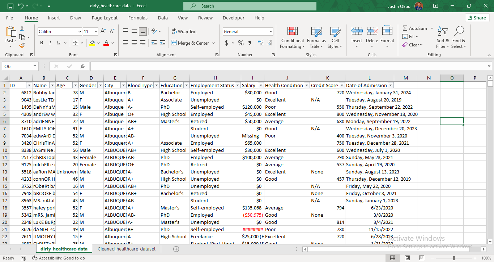

# Data_Cleaning_Using_Excel_and_PowerQuery

## TASK DETAILS
1. To perform exploratory analysis (EDA) to understand the dataset structure, identify anomalies and preliminary insights
2. Clean and prepare the data for further analysis, ensuring that it is consistent, accurate, and ready for use
3. Document your cleaning process detailing:
   - The steps taken
   - The logic behind the decision
   - Any assumptions made during the cleaning process
   - 
## EXECUTIVE SUMMARY
The essence of this project is to clean this data for analysis and create a detailed report. The dataset used was sourced from [GreenData Soultions](health_care_dirty_data)

#### Below is what the  data looked like initially

#### This is the data after proper cleaning

### STEPS TAKEN TO CLEAN THE DATA
1. Exploring the data for a better understanding
2. Choosing the right tool for fast delivery
3. Cleaning the data ready for analysis

### EXPLORING THE DATA
These were my findings before was effected
1. There were duplicate rows in the dataset
2. There were inconsistencies in the capitalization of a few columns like Name and country columns
3. comparing the education and age columns, I saw that one age distribution was incorrect. example someone who has a PhD and his/her age is showing 2 years old.
4. The date column consists of different date types and data types
5. There were nulls, unknowns, empty, N/A, and inconsistencies in the information cited in the Education, Salary, and Employment columns.

### DATA CLEANING PROCESS
These were how the data was cleaned using Excel and Power Query.
1. date column values were transformed to short date type
2. Duplicates were removed to focus on distinct values to avoid errors in the analysis
3. The name column was transformed to have case consistency
4. misspelled and other unnecessary values, in the city, employed, and education columns were properly formatted for consistency across the columns
5. All nulls, unknowns, empty, and non, were taken care of
6. I devised a formula to predict the ages of all the unknowns, from 0 to 16. In the US, the average age to graduate from high school is 17 to 18, so I worked with 17.

   Here is the formula: (=IF(OR([@Age2]<17,[@Age2]="unknown"), IF(OR([@Education]="Unspecified", [@Education]="Bachelor's", [@Education]="Associate", [@Education]="PhD", [@Education]="Master's", [@Education]="High School"), AVERAGE([Age2], AVERAGEIFS([Age2],[Education],[@Education]))), [@Age2]))

