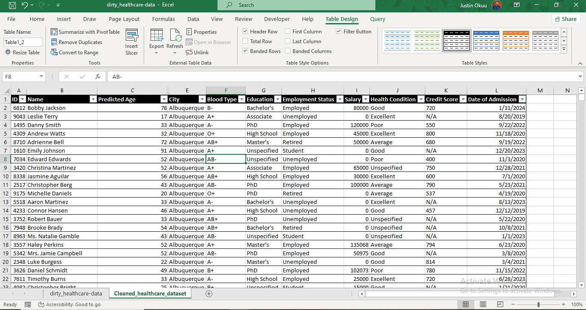

# Data_Cleaning_Using_Excel_and_PowerQuery

## TASK DETAILS
1. To perform exploratory analysis (EDA) to understand the dataset structure, identify anomalies and preliminary insights
2. Clean and prepare the data for further analysis, ensuring that it is consistent, accurate, and ready for use
3. Document your cleaning process detailing:
   - The steps taken
   - The logic behind the decision
   - Any assumptions made during the cleaning process
   - 
## EXECUTIVE SUMMARY
The essence of this project is to clean this data for analysis and create a detailed report.
Below is what the  data looked like initially

healthcare-dirty_and_cleaned_data.xlsx
